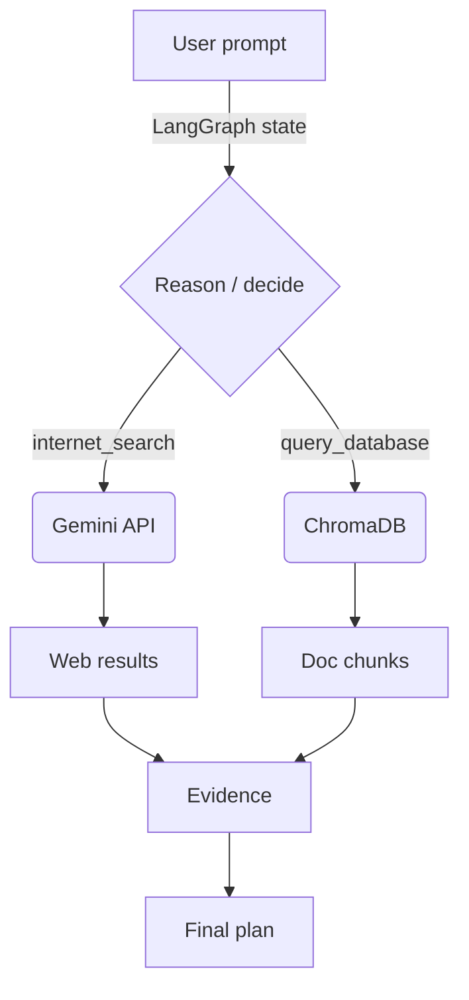

# KaliFox – Agentic Pentest Assistant  
_“Offense-aware, evidence-first plans in a single command.”_

## Table of Contents
1. [Project overview](#project-overview)  
2. [Folder structure](#folder-structure)  
3. [Quick start](#quick-start)  
4. [Detailed setup](#detailed-setup)  
5. [Running the agent](#running-the-agent)  
6. [Updating the knowledge base](#updating-the-knowledge-base)  
7. [Architecture in depth](#architecture-in-depth)  
8. [Troubleshooting](#troubleshooting)  
9. [Roadmap](#roadmap)

### Note on `uiagent/` Prototype  
You’ll notice a **`uiagent/`** folder in the repo. This was an **experimental front-end** we hoped to layer on top of the LangGraph core—giving the pentesting agent a simple desktop/web UI for chat, run-history, and evidence previews.  
The back-end logic (in `pentestagent/`) is fully functional, but the UI wrapper is **still a work-in-progress**; we kept it in the branch as a reference for future contributors who might want to pick it up and finish the wiring.

---

## Project overview
**KaliFox** is an LLM-driven penetration-testing copilot built during the Microsoft Agentic Hackathon.

* Blends **live web intelligence** (Gemini Search) with a **local, vetted knowledge base** (Kali Linux docs & pentest cheat-sheets in ChromaDB).  
* Uses a **LangGraph state machine** so the agent reasons step-by-step and always cites evidence.  
* Lets you swap OpenAI for a **fully local Ollama** model if you prefer offline operation.  

The result is a chat-style agent that returns numbered, reproducible pentest plans—never hand-wavy advice.

---

## Folder structure
```
.
├── chromadbtest/        # build + query the document index
│   ├── ingest_to_chroma.py
│   ├── query_chroma.py
│   ├── agent.py
│   └── storage/ | chroma_index/
├── pentestagent/        # production LangGraph agent
│   ├── pentest.py
│   └── requirements.txt
├── uiagent/             # experimental desktop / web launcher
│   ├── run_agent.py
│   └── tools.py | agent_graph.py
└── .gitattributes / .gitignore
```

---

## Quick start
```bash
# 1 – Clone the Kaleb branch
git clone -b Kaleb https://github.com/kjp1999/MicrosoftAgenticHackathon.git
cd MicrosoftAgenticHackathon

# 2 – Create a fresh Python 3.11 venv
python -m venv .venv
source .venv/bin/activate      # Windows: .venv\Scripts\activate

# 3 – Install core deps
pip install -r pentestagent/requirements.txt

# 4 – (Optional) install Playwright browsers
playwright install

# 5 – Set credentials
export GOOGLE_API_KEY="<your-key>"
export OPENAI_API_KEY="<your-key>"   # leave blank to use Ollama only

# 6 – Prime the knowledge base (≈ 3–5 min)
python chromadbtest/ingest_to_chroma.py --preset kali

# 7 – Launch!
python pentestagent/pentest.py
```

---

## Detailed setup

### 1. Python & system packages
* **Python 3.11** required.
* **Pull this github for docker container setup** https://github.com/XaviTorello/kali-full-docker required.

### 2. LLM back-ends

| LLMS | 
|--------|
| **OpenAI GPT-4o** |
| **Ollama  (local) (Model = artifish/llama3.2-uncensored)** |


### 3. Environment variables
```
GOOGLE_API_KEY   # enables grounded Gemini search
OPENAI_API_KEY   # optional; empty → Ollama only
OLLAMA_BASE_URL  # defaults to http://localhost:11434
```

### 4. Playwright
Used only for web-scraping:
```bash
playwright install
```

---

## Running the agent 
  ```bash
  python pentestagent/pentest.py
  ```
---

## Updating the knowledge base
1. Add URLs or local files to `chromadbtest/ingest_to_chroma.py`.  
2. Re-run the ingest script.  
3. To wipe everything:  
   ```bash
   python chromadbtest/clear-cache.py
   ```

---

## Architecture in depth (Initial Plan if we got everything working together)


**Key code paths**

| File | Purpose |
|------|---------|
| `pentestagent/pentest.py` | Builds LangGraph, defines tools & prompts |
| `chromadbtest/ingest_to_chroma.py` | Scrapes, chunks, embeds docs |
| `uiagent/run_agent.py` | Minimal desktop / web front-end |

---

## Troubleshooting

| Error / Symptom | Fix |
|-----------------|-----|
| `chromadb.errors.DuplicateIDError` | Run `chromadbtest/clear-cache.py` then ingest again |
| `playwright … Browser is closed`  | `playwright install` after venv creation |
| Torch shared object missing | Verify Python 3.11; reinstall `torch==2.2.2` |
| Ollama 404 | Ensure `ollama serve` is running **before** launching agent |

---

## Roadmap
* Multi-vector memory (Redis hierarchical index)  
* Replace Tk prototype with FastAPI + React dashboard  
* Auto-recon loop—agent refines plan after each executed command  

